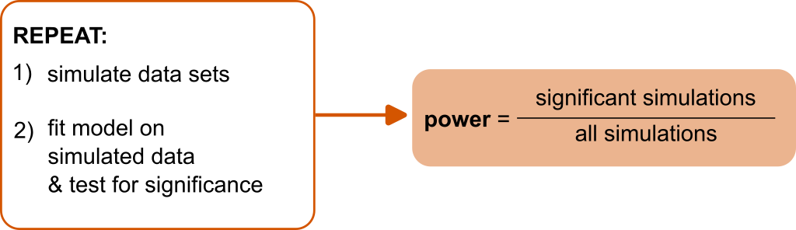

class: title-slide, center, inverse

# `r rmarkdown::metadata$title`

# `r rmarkdown::metadata$subtitle`

## `r rmarkdown::metadata$author`

### `r rmarkdown::metadata$date`


```{r setup, include=FALSE}

# slides & formatting
options(htmltools.dir.version = FALSE)
options(crayon.enabled = TRUE)

xaringanExtra::use_xaringan_extra(c("tile_view", "animate_css", "tachyons"))

# css: [rladies-fonts, default, custom/style.css]
library(xaringanthemer)
style_solarized_light(colors = c(
  red = "#f34213",
  purple = "#3e2f5b",
  orange = "#ff8811",
  green = "#136f63",
  white = "#FFFFFF",
  blue = " #0000FF"
))

# R stuff
library(lme4)
library(ggplot2)
nice_theme <- theme_xaringan()+theme(text=element_text(size=9),panel.border=element_blank(),strip.text=element_text(size=rel(0.8)),axis.text=element_text(size=8),panel.grid.minor=element_blank(),axis.line=element_line(size=.4), axis.title=element_text(size=11), legend.title=element_text(size=11))
theme_set(nice_theme)

background_plot <- nice_theme$plot.background$colour
knitr::opts_knit$set(global.par = TRUE) # fix par for multiple plots

library(tidyverse)
library(kableExtra)

#
library(lme4)
data("sleepstudy")
```

---
# Topics

- [Estimation methods, ML and REML](#estimation)

- [Parametric bootstrapping](#bootstrap)

- [Power analyses via fake-data simulation](#power)

- [Convergence warnings](#warning)


---
class: inverse
name: estimation

# Maximum likelihood estimation

- Find parameter values that maximize the .orange[likelihood function], which is the probability of the data under the model (treated as a function of the parameters, keeping the data fixed).
--


- In a normal regression model, this is equivalent to finding parameters that minimize the residual squared errors.
--


- In LMM, the random effects (e.g. participant-specific coefficients) are considered _unobserved_ random variables, and are integrated out - similar to the simple residuals $\epsilon_i$ in normal regression. 
--


- This makes the model likelihood not conditional on the specific instantiations of the random effects (e.g. the participants) and allow to generalize the results to the population. 
--

---
class: inverse

# Maximum likelihood estimation


- Technically: the probability of the data, conditional to the random effects, is integrated with respect to the marginal density of the random effects 
$$L\left(\text{data} \mid \beta,\sigma,\Omega \right) = \int p \left(\text{data} \mid \beta,\sigma, \bf{u}\right) \, p\left(\bf{u} \mid \Omega\right) \, d\bf{u}$$

--


- Once we have estimates of the parameters the random effects are typically _predicted_ in a second-step using an 'empirical Bayes' methodology 
$$p({\bf u} \mid \text{data};  \beta, \sigma, \Omega)\,\, \propto  \,\, p \left(\text{data} \mid \beta,\sigma, \bf{u}\right) \, p\left(\bf{u} \mid \Omega\right)$$

---

# ML vs REML

- The $\textsf{R}$ library `lme4` provides two methods for estimating parameters: .blue[Maximum Likelihood (ML)] and .blue[Restricted Maximum Likelihood (REML)].
--


- .blue[ML] tend to be biased and underestimate the variances (i.e. $\Omega$) because does not account for the fact that fixed effects need to be estimated when estimating the variance components (similar to maximum likelihood estimator of the sample variance).
--


- .blue[REML] provide less biased variance estimates: conceptually similar to Bessel's correction for sample variance (using $n-1$ instead of $n$ in the denominator when calculating the variance).
--


- REML is particularly useful when the sample size (number of clusters) is small; as the sample size increases the correspondence between ML and REML increases (they are asymptotically equivalent).


---

# ML vs REML

```{r}
m.ML <- lmer(Reaction ~ Days + (Days|Subject), sleepstudy, REML=FALSE)
m.REML <- lmer(Reaction ~ Days + (Days|Subject), sleepstudy, REML=TRUE)
```
--
```{r}
VarCorr(m.ML)
```

```{r}
VarCorr(m.REML)
```


---
name: bootstrap
# Parametric bootstrapping

- _Bootstrapping_ = random sampling with replacement to estimate the sampling distribution of a statistics.
--


- _Parametric_ bootstrapping: if we have a parametric model appropriate for the data we can simulate samples from the model instead of using the empirical distribution.
--


.red[**Parametric boostrapping procedure**:

1. Fit the model on available data
2. For $1,\ldots,n$ boostrap iterations
  1. Simulate new data from the model
  2. Re-estimate the model on the simulated data 
  3. Calculate any statistic of interest from the re-fitted model and store its value
  
Take all the values of the statistic estimated at each iteration and use it as approximation of the sampling distribution (e.g. to calculate confidence intervals)]

--

**For multilevel models we can simulate also new random-effects (e.g. new participant-specific coefficients) by drawing samples from their multivariate normal distribution**


---

# Parametric bootstrapping

In `sleepstudy` example, determine the sampling distribution of the average number of days of sleep deprivation needed to induce a 30% slowing of response times.

Fit the model:

```{r}
m.REML <- lmer(Reaction ~ Days + (Days|Subject), data=sleepstudy, REML=T)
```

--
Write a function that calculate the quantity of interest (that is, $0.3 \times \frac{\beta_0}{\beta_1}$) from the fitted model:
```{r}
my_function <- function(model){
  th <- (fixef(model)[1]*0.3)/fixef(model)[2]
  return(unname(th))
}
```

--

Using the function:
```{r}
my_function(m.REML)
```


---

# Parametric bootstrapping

```{r, echo=FALSE, message=FALSE}
boot_res <- readRDS("./misc/sleep_boot_res.RDS")
```


The function `bootMer()` make it easy to draw bootstrap samples

```{r, eval=FALSE}
boot_res <- bootMer(m.REML, 
                    FUN=my_function, # the function we just defined
                    nsim=1000, 
                    use.u = FALSE,   # setting to simulate random effects
                    type="parametric")
```

--

```{r}
str(boot_res[1:3])
```


---
# Parametric bootstrapping

Boostrapped sampling distribution of $0.3 \times \frac{\beta_0}{\beta_1}$

```{r, echo=FALSE}
par(bg = background_plot)
```


```{r, fig.height=3, fig.width=4, dev='svg'}
hist(boot_res$t, breaks =20)
```

---
# Parametric bootstrapping


Calculate confidence interval:

```{r}
alpha <- 0.05
c(quantile(boot_res$t, probs = alpha/2), quantile(boot_res$t, probs = 1- alpha/2))
```

--

```{r}
library(boot)
boot.ci(boot_res, type=c("perc"))
```


---
name: power
# Power analyses via fake-data simulations

--

.center[]

```{r, echo=FALSE, message=FALSE}
library(MEMSS)
library(lmerTest)
```


---
# Power analyses via fake-data simulations

Design a study that has at least 80% power of replicating the observed difference between `MachineC` and `MachineB`

```{r}
data(Machines)
contrasts(Machines$Machine) <- contr.treatment(levels(Machines$Machine), base=2)
machine.mod <- lmer(score ~ Machine + (Machine|Worker), Machines)
kable(summary(machine.mod)$coefficients, digits=3)
```


---
## 1) Extract parameters from fitted model object

```{r}
fit_par <- getME(machine.mod, c("theta","sigma")) 
fit_par$beta <- fixef(machine.mod)
fit_par
```
--

.footnote[In `lmer` the variance-covariance matrix of the random-effects is internally parametrized as the vector `theta`, which is the (colum-wise) unpacking of the lower triangular Cholesky factor of the variance-covariance matrix.]

---
## 2) Simulate new data

```{r}
sim_d <- expand.grid(Worker = factor(1:6),
                  Machine = unique(Machines$Machine),
                  rep = 1:3)

contrasts(sim_d$Machine) <- contr.treatment(levels(sim_d$Machine), base=2)

sim_d$score <- simulate(~ Machine + (Machine|Worker),
                        nsim=1,
                        family=gaussian,
                        newdata = sim_d,
                        newparams=fit_par,
                        use.u = FALSE)$sim_1

head(sim_d) # fake/simulated data
```

---
## 2) Simulate new data

It's convenient to wrap the simulation code in one custom function

```{r}
simulate_data <- function(N, fit_par){
  
  sim_d <- expand.grid(Worker = factor(1:N),
                       Machine = unique(Machines$Machine),
                       rep = 1:3)
  
  contrasts(sim_d$Machine) <- contr.treatment(levels(sim_d$Machine), base=2)
  
  sim_d$score <- simulate(~ Machine + (Machine|Worker),
                          nsim=1,
                          family=gaussian,
                          newdata = sim_d,
                          newparams=fit_par,
                          use.u = FALSE)$sim_1
  return(sim_d)
}
```

---
## 3) Test significance

Similarly, we use a function that test significance

```{r}
test_significance <- function(sim_d){
  mod <- lmer(score ~ Machine + (Machine|Worker), sim_d)
  p_value <- summary(mod)$coefficients["MachineC","Pr(>|t|)"]
  return(p_value)
}
```

--

```{r}
test_significance(sim_d)
```


---
## 4) Repeat...


```{r, echo=FALSE, message=FALSE,warning=FALSE}
sim_res <- readRDS("./misc/machine_sim01.RDS")
sim_res$significant <- ifelse(sim_res$p<0.05 ,1 ,0)
```


```{r, eval=FALSE}
N_sim <- 200
N_workers <- c(6, 7, 8, 9, 10, 12, 15)
sim_res <- data.frame() # empty object for storing results

for(w in N_workers){
  for(i in 1:N_sim){
    p_val <- test_significance(simulate_data(w, fit_par))
    sim_res <- rbind(sim_res, data.frame(N=w, p=p_val))
  }
}

sim_res$significant <- ifelse(sim_res$p<0.05 ,1 ,0)
```


---
## 5) Estimate power

```{r, fig.height=3, fig.width=4, dev='svg', message=F, fig.align='center'}
sim_res %>%
  group_by(N) %>%
  summarise(SE = sqrt((mean(significant) * (1 - mean(significant)))/length(significant)),
            significant = mean(significant)) %>%
  ggplot(aes(x=N, y=significant))+
  geom_line(color="blue")+
  geom_errorbar(aes(ymin=significant-SE, ymax=significant+SE),width=0,color="blue")+
  geom_point(color="blue",size=2)+
  geom_hline(yintercept = 0.8,lty=2)+
  labs(y="power")
```


---
## Testing a different effect size

Standardized effect size: $d = \frac{\mu_1 - \mu_2}{\sigma}$

--

For LMM: $d = \frac{\beta_{\text{Machine}_C}}{\sqrt{\frac{\sigma^2_{\epsilon}}{3-1} + \sigma^2_{\beta_0} + \frac{1}{2}\sigma^2_{\beta_{\text{Machine}_C}} + \rho \sigma_{\beta_0} \sigma_{\beta_{\text{Machine}_C}}}}$


---
class:inverse

.orange[Standardized effect size definition:]

$$\text{Cohen's }d = \frac{\text{expected mean difference}}{\text{expected variation individual observation}}$$

--

.orange[The expected variation is calculated by applying rules for summing variances of random variables:]

$$\begin{align} d & = \frac{\beta_{\text{Machine}_C}}{\sqrt{\underbrace{\frac{\sigma^2_{\epsilon}}{3-1}}_{\text{residual error}} + \underbrace{\frac{1}{2}\sigma^2_{\beta_0} + \frac{1}{2}\left(\sigma^2_{\beta_0}+ \sigma^2_{\beta_{\text{Machine}_C}} + 2 \rho \sigma_{\beta_0} \sigma_{\beta_{\text{Machine}_C}}\right)}_{\text{pooled variance of mean score for Machine}_B \text{ and Machine}_C} }} \\
& = \frac{\beta_{\text{Machine}_C}}{\sqrt{\frac{\sigma^2_{\epsilon}}{3-1} + \sigma^2_{\beta_0} + \frac{1}{2}\sigma^2_{\beta_{\text{Machine}_C}} + \rho \sigma_{\beta_0} \sigma_{\beta_{\text{Machine}_C}}}} 
\end{align}$$


---
## Testing a different effect size

Standardized effect size: $d = \frac{\mu_1 - \mu_2}{\sigma}$

--

For LMM: $d = \frac{\beta_{\text{Machine}_C}}{\sqrt{\frac{\sigma^2_{\epsilon}}{3-1} + \sigma^2_{\beta_0} + \frac{1}{2}\sigma^2_{\beta_{\text{Machine}_C}} + \rho \sigma_{\beta_0} \sigma_{\beta_{\text{Machine}_C}}}}$

--

```{r}
Omega <- VarCorr(machine.mod)
cohen_d <- fixef(machine.mod)["MachineC"] / sqrt(fit_par$sigma^2/(3-1)
                                           + Omega$Worker["(Intercept)","(Intercept)"] 
                                           + 0.5*Omega$Worker["MachineC","MachineC"]
                                           + Omega$Worker["(Intercept)","MachineC"])
cohen_d
```


---
## Testing a different effect size


Say you want to test a medium effect size $d = 0.5$. 
--


To achieve this we need to change the values of $\beta_{\text{Machine}_C}$ used in the simulations to $d \times \sqrt{\frac{\sigma^2_{\epsilon}}{N_{\text{rep}}-1} + \sigma^2_{\beta_0} + \frac{1}{2}\sigma^2_{\beta_{\text{Machine}_C}} + \rho \sigma_{\beta_0} \sigma_{\beta_{\text{Machine}_C}}}$


--
In R:

```{r}
cohen_sigma <- sqrt(fit_par$sigma^2/(3-1)
                    + Omega$Worker["(Intercept)","(Intercept)"] 
                    + 0.5*Omega$Worker["MachineC","MachineC"]
                    + Omega$Worker["(Intercept)","MachineC"])
new_beta_MachineC <- 0.5 * cohen_sigma
```

--
Replace the beta in the parameters used for the simulation:

```{r}
fit_par$beta["MachineC"] <- new_beta_MachineC
```


---
## Testing a different effect size: results

```{r, echo=F, message = F}
sim_res_all <- rbind(readRDS("./misc/machine_sim01_d.RDS"), readRDS("./misc/machine_sim02_d.RDS"))

```

```{r, fig.height=3, fig.width=4, dev='svg', message=F, fig.align='center', echo=FALSE}
library(pwr)
eqttest <- data.frame(N=5:50)
eqttest$power <- pwr.t.test(n=eqttest$N, d=0.5, type="paired")$power

sim_res_all %>%
  group_by(N,cohen_d) %>%
  summarise(SE = sqrt((mean(significant) * (1 - mean(significant)))/length(significant)),
            significant = mean(significant)) %>%
  ggplot(aes(x=N, y=significant, group=cohen_d, color=cohen_d))+
  geom_line(data=eqttest,aes(x=N,y=power),color="dark grey", lty=1)+
  geom_line()+
  geom_errorbar(aes(ymin=significant-SE, ymax=significant+SE),width=0)+
  geom_point(size=2)+
  coord_cartesian(xlim=c(5,50))+
  geom_hline(yintercept = 0.8,lty=2)+
  labs(y="power")
```


---
class: inverse

- The power simulations so far rest on assumptions about the variability in the data (residual variance, random-effects variance-covariance matrix)
--


- We can vary the values of the variances and covariances parameters to estimate how these influence power. This involve running more simulations using different values to generate the data.
--


- To use `simulate()` we  convert the new variance-covariance matrix in the parameter vector `theta`:
```{r}
VarCov2Theta <- function(X, sigma){
  X <- t(chol(X/sigma^2)) 
  X_unpacked <- X[lower.tri(X, diag=T)]
  return(X_unpacked)
}
```
--


- For more complex model it may be easier to write a function that simulate the data using directly the variance-covariance matrix to sample random effects (e.g. `mvrnorm()` function in `MASS` package).


---
## Varying assumptions about random effects variability: results

```{r, fig.height=3, fig.width=4, dev='svg', message=F, echo=F, fig.align='center'}
sim03 <- readRDS("./misc/machine_sim03.RDS")
sim03 %>%
  group_by(N,vs) %>%
  summarise(SE = sqrt((mean(significant) * (1 - mean(significant)))/length(significant)),
            significant = mean(significant)) %>%
  ggplot(aes(x=N, y=significant, group=vs, color=vs))+
  geom_line()+
  scale_color_continuous(name="variance\nscaling")+
  geom_errorbar(aes(ymin=significant-SE, ymax=significant+SE),width=0)+
  geom_point(size=2)+
  geom_hline(yintercept = 0.8,lty=2)+
  labs(y="power")
```

.footnote[Colors indicate scaling factor of random effects variances; random effects correlation parameters were kept constant.]

---
class: inverse
name: warning
# Convergence warnings

--

```{r, eval=F}
>Warning message:
In checkConv(attr(opt, "derivs"), opt$par, ctrl = control$checkConv,  :
  Model failed to converge with max|grad| = 0.00389462 (tol = 0.001)
```

--

- Warning indicates the numerical optimization algorithm can't verify to have found the best set of parameter values (often because the 1 or more of the estimated random effects variances are too close to zero).
--


- Banning other problems in the model, this typically means that there is too little data for the number of free parameters being estimated (another reason for thinking carefully about the data analysis _before_ collecting the data)
--


- Troubleshooting: try centering/scaling continuous predictos, running more iterations (e.g. see [this tutorial](https://rstudio-pubs-static.s3.amazonaws.com/33653_57fc7b8e5d484c909b615d8633c01d51.html)) or a different optimization algorithm (see the [`allFit`](https://www.rdocumentation.org/packages/afex/versions/0.16-1/topics/allFit) function).


