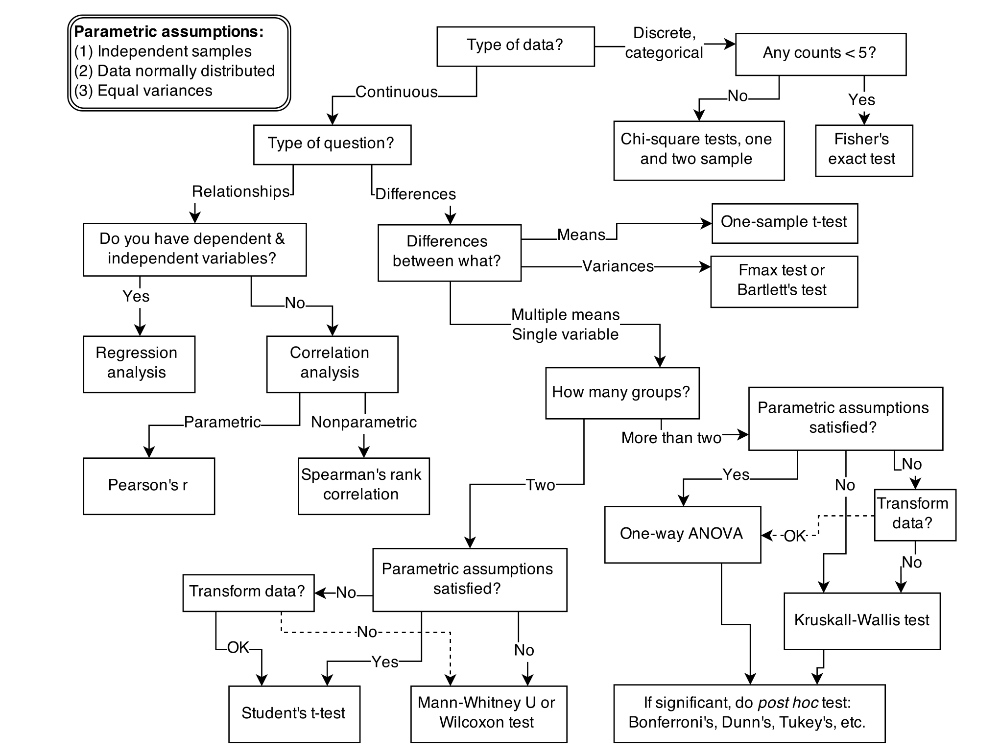
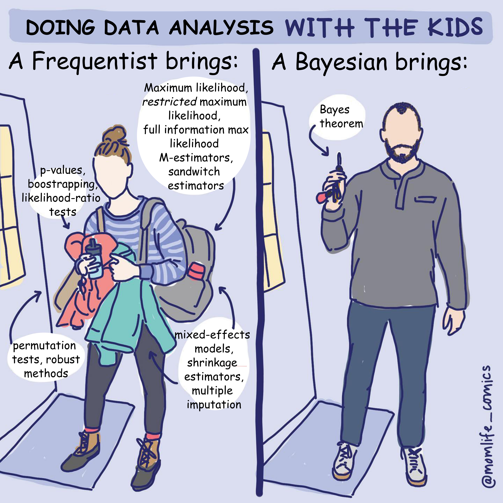
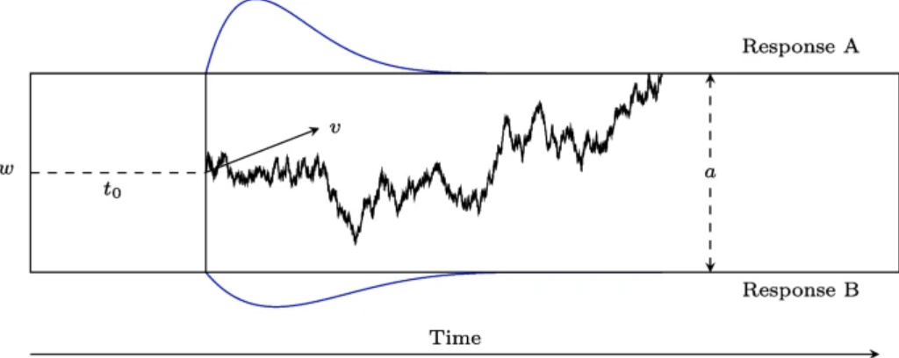

```{r setup, include=FALSE}
options(htmltools.dir.version = FALSE)
knitr::opts_chunk$set(
  fig.width=9, fig.height=3.5, fig.retina=3,
  out.width = "100%",
  cache = FALSE,
  echo = TRUE,
  message = FALSE, 
  warning = FALSE,
  hiline = TRUE
)
```

```{r xaringan-themer, include=FALSE, warning=FALSE}
# slides & formatting
options(htmltools.dir.version = FALSE)
options(crayon.enabled = TRUE)

xaringanExtra::use_xaringan_extra(c("tile_view", "animate_css", "tachyons"))

library(xaringanthemer)
style_duo_accent(
  #primary_color = "#1381B0",
  primary_color = "#3e2f5b",
  secondary_color = "#FF961C",
  inverse_header_color = "#FFFFFF",
  colors = c(purple = "#3e2f5b",
  red = "#f34213",
  blue = " #0000FF",
  orange = "#ff8811")
)

# https://pkg.garrickadenbuie.com/xaringanthemer/articles/themes.html
# style_mono_dark(base_color = "#cbf7ed")

# style_solarized_light(colors = c(
#   red = "#f34213",
#   purple = "#3e2f5b",
#   orange = "#ff8811",
#   green = "#136f63",
#   white = "#FFFFFF",
#   blue = " #0000FF"
# ))


library(tidyverse)
library(kableExtra)

nice_theme <- theme_xaringan()+theme(text=element_text(size=9),panel.border=element_blank(),strip.text=element_text(size=rel(0.8)),axis.text=element_text(size=8),panel.grid.minor=element_blank(),axis.line=element_line(size=.4), axis.title=element_text(size=11), legend.title=element_text(size=11))
theme_set(nice_theme)

background_plot <- nice_theme$plot.background$colour
knitr::opts_knit$set(global.par = TRUE) # fix par for multiple plots

par(bg = background_plot)

# other
library(lme4)

library(tidybayes)
library(rtdists)
library(ggplot2)

```

class: title-slide, center, inverse

# `r rmarkdown::metadata$title`

<!-- # `r rmarkdown::metadata$subtitle` -->

<br>
<br>
<br>
<br>

## `r rmarkdown::metadata$author`

### `r rmarkdown::metadata$date`

---

### Disclaimer

<br>

.center[]

<br>

--

.center[There is no 'dark side' in statistics.]


---
class: small-font-page

.center[]

.right[Image from 'Statistical rethinking', Richard McElreath.]

<!-- --- -->

<!-- .center[] -->


---

## Outline

1. How to fit a model to data: frequentist & Bayesian approaches
2. Computations in Bayesian inference & MCMC sampling
3. Examples
4. Bayes factors


---
### Fitting a model: frequentist approach

- Maximum likelihood estimation (MLE)
--

- **Likelihood function**: a mathematical function that gives the probability of observing the data, given specific values for the parameters of a statistical model. 
--


- The higher the value of the likelihood function for a set of parameters, the more likely it is that these parameters are the correct ones that explain our data.


---

.pull-left[
#### MLE in linear regression

- The best fitting line in linear regression minimizes the sum of squared residuals (errors).
<br>
]


```{r, fig.align='center', fig.height=6, fig.width=12, dev='svg', echo=F, message=F, warning=F, out.width='90%'}

set.seed(8)
N <- 10
x <- seq(5,50,length.out=N)+rnorm(N,mean=0,sd=0.1)
y <- 12 + 0.5 * x + rnorm(N, mean=0, sd=6)
d <- data.frame(x,y)
rm(x)
rm(y)
pl_r <- c(-4,53)

m0 <- lm(y~x,d)
beta <- coef(m0)

par(mfrow=c(1,2))

# helpers
draw_squared_error <- function(x,y,beta,col_rect =rgb(1,0,0,0.4)){
  pred_y <- beta[1] + beta[2]*x
  if(pred_y<=y){
    xleft <- x - abs(pred_y-y)
    ybottom <- pred_y
    xright <- x
    ytop <- y
  }else{
    xleft <- x 
    ybottom <- y
    xright <- x + abs(pred_y-y)
    ytop <- pred_y
  }
  rect(xleft, ybottom, xright, ytop, density = NA,col = col_rect, border = F)
}

plot(d$x,d$y,pch=19,cex=2,col=rgb(0,0,0,0.7),xlab="x (predictor variable)",ylab="y (dependent variable)",xlim=c(pl_r[1],pl_r[2]),ylim=c(pl_r[1],pl_r[2]))
abline(m0,lwd=2)
for(i in 1:nrow(d)){
  draw_squared_error(d$x[i],d$y[i],beta)
}
arrows(d$x,beta[1]+beta[2]*d$x,d$x,d$y,col=rgb(1,0,0,0.9),lwd=2,length=0.1)
text(39, -3, bquote(hat(y) ~ "=" ~ beta[0] ~ "+" ~ beta[1] ~ x))


```


---
count: false

.pull-left[
#### MLE in linear regression

- The best fitting line in linear regression minimizes the sum of squared residuals (errors).
<br>

]

.pull-left[

<br>

- Equivalent to maximizing the probability of the data assuming residuals have a Gaussian distribution centred on predicted values.]

```{r, fig.align='center', fig.height=6, fig.width=12, dev='svg', echo=F, message=F, warning=F, out.width='90%'}

set.seed(8)
N <- 10
x <- seq(5,50,length.out=N)+rnorm(N,mean=0,sd=0.1)
y <- 12 + 0.5 * x + rnorm(N, mean=0, sd=6)
d <- data.frame(x,y)
rm(x)
rm(y)

m0 <- lm(y~x,d)
beta <- coef(m0)

par(mfrow=c(1,2))

# helpers
draw_squared_error <- function(x,y,beta,col_rect =rgb(1,0,0,0.4)){
  pred_y <- beta[1] + beta[2]*x
  if(pred_y<=y){
    xleft <- x - abs(pred_y-y)
    ybottom <- pred_y
    xright <- x
    ytop <- y
  }else{
    xleft <- x 
    ybottom <- y
    xright <- x + abs(pred_y-y)
    ytop <- pred_y
  }
  rect(xleft, ybottom, xright, ytop, density = NA,col = col_rect, border = F)
}

plot(d$x,d$y,pch=19,cex=2,col=rgb(0,0,0,0.7),xlab="x (predictor variable)",ylab="y (dependent variable)",xlim=c(pl_r[1],pl_r[2]),ylim=c(pl_r[1],pl_r[2]))
abline(m0,lwd=2)
for(i in 1:nrow(d)){
  draw_squared_error(d$x[i],d$y[i],beta)
}
arrows(d$x,beta[1]+beta[2]*d$x,d$x,d$y,col=rgb(1,0,0,0.9),lwd=2,length=0.1)
text(39, -3, bquote(hat(y) ~ "=" ~ beta[0] ~ "+" ~ beta[1] ~ x))

###

plot_vertical_gaussian <- function(x,y,y_span,sigma,x_factor=5,...){
  N <- 100
  y_coord <- seq(y-y_span,y+y_span,length.out=N)
  x_coord <- x - x_factor*dnorm(y_coord-y, mean=0,sd=sigma)
  lines(c(x_coord[1],x_coord[length(x_coord)]),c(y_coord[1],y_coord[length(y_coord)]),lwd=1,lty=2)
  arrows(x - x_factor*dnorm(0, mean=0,sd=sigma),y,x,y,length=0.11,...)
  lines(x_coord,y_coord,...)
}

sd_residuals <- sqrt(sum(m0$residuals^2)/(nrow(d)-2))


plot(d$x,d$y,pch=19,cex=2,col=rgb(0,0,0,0.3),xlab="x (predictor variable)",ylab="y (dependent variable)",xlim=c(pl_r[1],pl_r[2]),ylim=c(pl_r[1],pl_r[2]))
abline(m0,lwd=2)
#arrows(d$x,beta[1]+beta[2]*d$x,d$x,d$y,col=rgb(1,0,0,0.9),lwd=2,length=0.1)
text(39, -3, bquote(hat(y) ~ "=" ~ beta[0] ~ "+" ~ beta[1] ~ x))

for(i in seq(8,43,length.out=4)){
  plot_vertical_gaussian(i,beta[1]+beta[2]*i,y_span=18,sigma=sd_residuals,x_factor=100,col="red",lwd=2)
}


```


---


## Likelihood function

- Defined as the probability of the data, given some parameter values, usually notated as $p(\text{data} \mid \text{parameters})$.

--

- For a simple linear regression $$y_i= \beta_0 + \beta_1x_i+\epsilon_i$$ $$\epsilon_i \sim \mathcal{N}(0, \sigma^2)$$
--
the likelihood is 
$$p(\underbrace{y, x}_{\text{data}} \mid \underbrace{\beta_0, \beta_1, \sigma^2}_{\text{parameters}} ) = \underbrace{\prod_{i=1}^{n}}_{\text{product}} \,\, \underbrace{\mathcal{N}(\overbrace{\beta_0 + \beta_1 x_i}^{\text{predicted value}}\,\,,\,\,\, \sigma^2)}_{\text{Gaussian probability density}}$$


---
count: false

## Likelihood function

- Defined as the probability of the data, given some parameter values, usually notated as $p(\text{data} \mid \text{parameters})$.


- For a simple linear regression $$y_i= \beta_0 + \beta_1x_i+\epsilon_i$$ $$\epsilon_i \sim \mathcal{N}(0, \sigma^2)$$ the likelihood is 
$$p(\underbrace{y, x}_{\text{data}} \mid \underbrace{\beta_0, \beta_1, \sigma^2}_{\text{parameters}} ) = \underbrace{\prod_{i=1}^{n}}_{\text{product}} \,\, \underbrace{\frac{1}{\sqrt{2\pi\sigma^2}} e^{-\frac{(y_i - \overbrace{(\beta_0 + \beta_1 x_i)}^{\text{predicted value}})^2}{2\sigma^2}}}_{\text{Gaussian probability density}}$$

---

## Likelihood function

In practice, we usually work with the logarithm of the likelihood function (_log-likelihood_)

<br>

$$\begin{align} 
\mathcal{L}(y, x \mid \beta_0, \beta_1, \sigma^2 )  & = \log \left[ L(y, x \mid \beta_0, \beta_1, \sigma^2)  \right]\\
 & = -\frac{n}{2}\log(2\pi) - \frac{n}{2}\log(\sigma^2) - \frac{1}{2\sigma^2} \underbrace{\sum_{i=1}^n \left( y_i - \beta_0 - \beta_1 x_i\right)^2}_{\text{sum of squared residual errors}}\\
\end{align}$$
--

- .purple[**The values of intercept] $\beta_0$ .purple[and slope] $\beta_1$ .purple[that minimize the sum of squared residuals also maximize the (log) likelihood function.**]


---
## The _frequentist_ approach

- Maximum likelihood estimation is the backbone of statistical estimation in the frequentist inference.

--

- Key aspects of frequentist inference:

--

  - Parameters are considered unknown _fixed_ quantities.

--

  - The objective is to find best point-estimates for these parameters.

--

  - Uncertainty regarding the value of a parameter is not quantified using probabilities.

--

  - Uncertainty in the estimates is expressed in relation to the data-generating process (think about the un-intuitive definition of confidence interval).

--

  - probability is interpreted as the _long-term frequency_ of an event occurring a very large (infinite) series of repeated trials or samples.
    
    
---
## The _Bayesian_ approach

--

- What is different in the Bayesian approach?

--

  - Probability represents the _degree of belief_ or confidence in the occurrence of an event or the truth of a proposition.

--

  - Parameters are treated as random variables with associated uncertainty, described by a _prior_ probability distribution.

--

  - The objective is to refine the prior distribution using observed data, yielding an updated _posterior_ probability distribution.

--

  - This update is achieved through Bayes' theorem, however the Bayesian approach _is not_ defined by the use Bayes' theorem itself (which is just an implication of the axioms of probability).

--

  - _"The essential characteristic of Bayesian methods is their explicit use of probability for quantifying uncertainty in inferences based on statistical analysis"_ (Gelman et al., 2013).

---

## Elements of Bayesian models

- In a typical Bayesian setting we have:

--

  - **likelihood** $p\left(\text{data} \mid \theta\right)$, giving probability of the data conditional on the parameter(s) $\theta$;

--

  - **prior** $p\left(\theta\right)$, which formalizes _a-priori_ belief about the plausibility of parameter values

--

  - **posterior** distribution, obtained by applying Bayes theorem: $$p\left(\theta \mid \text{data}\right) = \frac{p\left(\text{data} \mid \theta\right)  p\left(\theta\right)}{p\left( \text{data} \right)}$$

---
count:false

## Elements of Bayesian models

- In a typical Bayesian setting we have:

  - **likelihood** $p\left(\text{data} \mid \theta\right)$, giving probability of the data conditional on the parameter(s) $\theta$;

  - **prior** $p\left(\theta\right)$, which formalizes _a-priori_ belief about the plausibility of parameter values

  - **posterior** distribution, obtained by applying Bayes theorem:$$ p\left(\theta \mid \text{data}\right) = \frac{p\left(\text{data} \mid \theta\right)p\left(\theta\right)}{\int p\left( \text{data} \mid \theta \right) p\left(\theta\right) d\theta}$$

<!-- <div class="notes"> -->
<!-- This is called averaged likelihood because it is averaged over the prior (also called the evidence or the probability of the data). Also called marginal likelihood because it is marginalised over all possible values of $\theta$ weighted by their probability. -->
<!-- </div> -->


---
count:false

## Elements of Bayesian models

- In a typical Bayesian setting we have:

  - **likelihood** $p\left(\text{data} \mid \theta\right)$, giving probability of the data conditional on the parameter(s) $\theta$;

  - **prior** $p\left(\theta\right)$, which formalizes _a-priori_ belief about the plausibility of parameter values

  - **posterior** distribution, obtained by applying Bayes theorem:  $$\text{posterior} = \frac{\text{likelihood} \times \text{prior}}{\text{average likelihood}}$$


---
count:false

## Elements of Bayesian models

- In a typical Bayesian setting we have:

  - **likelihood** $p\left(\text{data} \mid \theta\right)$, giving probability of the data conditional on the parameter(s) $\theta$;

  - **prior** $p\left(\theta\right)$, which formalizes _a-priori_ belief about the plausibility of parameter values

  - **posterior** distribution, obtained by applying Bayes theorem: $$\text{posterior} \propto \text{likelihood} \times \text{prior}$$


---

## Bayesian parameter inference

- When we're interested in a specific parameter (e.g. the slope $\beta_1$) we focus on its _marginal posterior distribution_.

--

- The marginal posterior distribution is found by integrating over other parameters in the posterior - think of this as averaging out the effects of all other parameters to focus only on $\beta_1$ 

--

  formally: $p\left(\beta_1 \mid \text{data} \right)=\int \int p\left(\beta_1, \beta_0, \sigma \mid \text{data} \right) d\beta_0 d\sigma$)

--

- As models become complex, this calculation gets challenging because it involves averaging (or marginalizing) over many parameters.

--

- We often use computer simulations, like Markov Chain Monte Carlo (MCMC) sampling, to handle these calculations efficiently.

--

- After performing MCMC, we end up with 'samples' drawn from the posterior distribution. With these in hand, summarizing the the marginal posterior becomes simply a matter of 'counting' the samples.


---
class: inverse

### Metropolis algorithm

Say you want to sample from a probability distribution $p({\bf x})$ (e.g. the posterior), but you can only evaluate a function $f({\bf x})$ that is proportional to the density $p({\bf x})$ (e.g. the product of prior and likelihood).


--

- **Initialization**:

--

  1. choose arbitrary starting point ${\bf x}_0$

--

  2. choose a probability distribution to generate proposals $g({\bf x}_{n+1}|{\bf x}_n)$ (_proposal density_)

--


- **For each iteration $i$**:

--

  1. generate a candidate ${\bf x'}$ sampling from $g({\bf x}_{i+1}|{\bf x}_{i})$

--

  2. calculate the .purple[acceptance ratio] $a = \frac{f({\bf x}')}{f({\bf x}_{i})}$

--

  3. .purple[accept/reject]: generate a uniform number $u$ in $[0,1]$

--

   - if $u \le a$, accept and set ${\bf x}_{i+1}={\bf x'}$ (_"move to the new value"_)

--

   - if $u > a$, reject and set ${\bf x}_{i+1}={\bf x}_{i}$  (_"stay where you are"_)


---
### MCMC example

Implementing Metropolis algorithm to fit regression for one participant of the dataset `sleepstudy` (from the `lme4` package).


```{r, fig.align='center', echo=F, fig.width=4, fig.height=4, dev='svg', out.width='30%'}
par(mfrow=c(1,1))
with(sleepstudy[sleepstudy$Subject=="308",],
     plot( Days,Reaction,pch=19,main="308",xlim=c(-1,11),ylim=c(200,500))
)
```


- To sample from the posterior we only need to compute the prior and the likelihood.

---
### MCMC example: likelihood

Custom function to compute the (log) likelihood, keeping the data fixed.

```{r}
x <- sleepstudy$Days[sleepstudy$Subject=="308"]
y <- sleepstudy$Reaction[sleepstudy$Subject=="308"]

loglik <- function(par){
  # parameter vector = [intercept, slope, log(SD)]
  pred <- par[1] + par[2]*x
  return(sum(dnorm(y, mean = pred, sd = exp(par[3]), log = TRUE)))  #<<
}
```

---
### MCMC example: priors

Prior distribution about parameter values

```{r, echo=F, fig.width=8, fig.height=3, dev='svg'}
par(mfrow=c(1,3))
curve(dnorm(x, mean=250, sd=180),from=0, to=1000, xlab="Intercept",ylab="prior density", col="blue")
curve(dnorm(x, mean=20, sd=20),from=-50, to=50, xlab="Slope",ylab="prior density", col="blue")

x_pSD <- seq(-1,6, length.out = 500)
y_pSD <- dnorm(x_pSD , mean=4,sd=1)
plot(exp(x_pSD),y_pSD, type="l", xlab=expression(sigma[epsilon]),ylab="prior density", col="blue")
```

---
### MCMC example: priors

Prior distribution about parameter values

```{r, echo=F, fig.width=8, fig.height=3, dev='svg'}
par(mfrow=c(1,3))
curve(dnorm(x, mean=250, sd=180),from=0, to=1000, xlab="Intercept",ylab="prior density", col="blue")
curve(dnorm(x, mean=20, sd=20),from=-50, to=50, xlab="Slope",ylab="prior density", col="blue")

x_pSD <- seq(-1,6, length.out = 500)
y_pSD <- dnorm(x_pSD , mean=4,sd=1)
plot(x_pSD,y_pSD, type="l", xlab=expression(paste("log ",sigma[epsilon])),ylab="prior density", col="red")
```

---
### MCMC example: priors

Similar to the likelihood, we write a custom function that compute the joint log-prior probability

```{r}
logprior <- function(par){
  intercept_prior <- dnorm(par[1], mean=250, sd=180, log=TRUE)
  slope_prior <- dnorm(par[2], mean=20, sd=20, log=TRUE)
  sd_prior <- dnorm(par[3],mean=4, sd=1, log=TRUE)
  return(intercept_prior+slope_prior+sd_prior) #<<
}
```

--

Note: logarithm transform a product into a sum: $\log(x \times y) = \log(x) + \log(y)$

---
### MCMC example

Put together likelihood and prior to obtain the (log) posterior probability

```{r}
logposterior <- function(par){
  return (loglik(par) + logprior(par))
}
```


---
### MCMC example

Choose the arbitrary starting point and the proposal density $g({\bf x}_{n+1}|{\bf x}_n)$ 

```{r}
# initial parameters
startvalue <- c(250, 20, 5) #  [intercept, slope, log(SD)]

# proposal density
proposalfunction <- function(par){
  return(rnorm(3, mean = par, sd= c(15,5,0.2))) #<<
}

```

---
### MCMC example

This function execute iteratively the step we have seen before

```{r}
run_metropolis_MCMC <- function(startvalue, iterations){
  
  # set up an empty array to store smapled values
  chain <- array(dim = c(iterations+1,3))
  
  # put starting values at top of arrays
  chain[1,] <- startvalue
  
  for (i in 1:iterations){
    
    # draw a random proposal
    proposal <- proposalfunction(chain[i,])
    
    # ratio of posterior density between new and old values
    a <- exp(logposterior(proposal) - logposterior(chain[i,]))
    
    # sample random number & accept/reject the parameter values
    if (runif(1) < a){
      chain[i+1,] <- proposal
    }else{
      chain[i+1,] <- chain[i,]
    }
  }
  return(chain)
}
```


---
### MCMC example

```{r, include=FALSE}
load("chain_ex.RData")
```

Run sampling for many iterations

```{r, eval=FALSE}
chain <- run_metropolis_MCMC(startvalue, 20000)
```

Output:

```{r}
head(chain)
```


---
### MCMC example


```{r, echo=F, fig.width=7, fig.height=4, fig.align='center', , dev='png', dpi=150, out.width='85%'}
#set.seed(3)
#chain <- run_metropolis_MCMC(startvalue, 20000)
# #save(chain, file="chain_ex.RData")
# load("chain_ex.RData")

burnIn <- 5000
acceptance <- 1-mean(duplicated(chain[-(1:burnIn),]))

LSfit <- lm(y~x)
interceptLS <- coef(LSfit)[1]
slopeLS <- coef(LSfit)[2]
sigmaLS <- summary(LSfit)$sigma

par(mfrow = c(2,3))
hist(chain[-(1:burnIn),1],main="Intercept",border="white",col="dark grey", breaks=20)
abline(v = interceptLS, col="red",lwd=2)
hist(chain[-(1:burnIn),2],main="Slope",border="white",col="dark grey", breaks=20)
abline(v = slopeLS , col="red",lwd=2)
hist(exp(chain[-(1:burnIn),3]),main=expression(sigma[epsilon]),border="white",col="dark grey", breaks=20)
abline(v = sigmaLS, col="red" ,lwd=2)

plot(chain[-(1:burnIn),1], type = "l", main = "Chain values")
abline(h = interceptLS, col="red",lwd=2)
plot(chain[-(1:burnIn),2], type = "l" , main = "Chain values")
abline(h = slopeLS, col="red",lwd=2)
plot(exp(chain[-(1:burnIn),3]), type = "l" , main = "Chain values")
abline(h = sigmaLS, col="red",lwd=2)
```

---
### MCMC example

Having the samples from the posterior distribution, summarising uncertainty is simply a matter of counting values. 

--

We can calculate a 95% Bayesian credible interval for slope by taking the 2.5th and 97.5th percentiles of posterior samples

```{r}
# remove initial 'burn in' samples
burnIn <- 5000
slope_samples <- chain[-(1:burnIn),2]

# mean of posterior distribution
mean(slope_samples)

# 95% Bayesian credible interval
alpha <- 0.05
round(c(quantile(slope_samples, probs = alpha/2),
        quantile(slope_samples, probs = 1-alpha/2)),
      digits=2)
```


---
class: inverse

- The Metropolis algorithm is the grandparent of modern MCMC techniques for drawing samples from unknown posterior distributions.

--

- Proposals are random and that can make it very inefficient, especially as the complexity of the model (and thus of the posterior) increases.

--

- Modern algorithm are more _efficient_, they use clever proposal methods to get a better picture of the posterior distribution with fewer samples.

--

- A state-of-the-art algorithm is Hamiltonian Monte Carlo (HMC), which is used by the free software Stan ([mc-stan.org](http://mc-stan.org/)).

---
class: inverse
## Stan

- Stan (named after Stanislaw Ulam, 1909-1984, co-inventor of MCMC methods) is a probabilistic programming language that makes it easy to do Bayesian inference on complex models.

--

- Once a model is defined, Stan compiles a C++ program that uses HMC to draw samples from the posterior density.

--

- Stan is free, open-source, has a comprehensive documentation and interfaces for the most popular computing environments (R, Matlab, Python, Mathematica)


---

### Stan examples

1. Linear regression

2. Drift-diffusion model

---
.pull-left[

### 1. Linear regression in Stan


Walking speed dataset:


```{r}
d <- read.table ("../data/wagespeed.csv", 
                 header=T, 
                 sep=",")


head(d)

```

]

--


.pull-right[

```{r, echo=FALSE, fig.align='center',fig.width=6, fig.height=6.5, out.width='100%', dev='svg'}
par(mfrow=c(1,1))
plot(d$wage, d$wspeed,
     xlab = "Hourly wage (NY=100)",
     ylab = "Mean walking speed (m/min)",
     pch = 19,       # solid circle points
     col = "blue",   # blue color for the points
     cex.lab = 1.2,  # size of axis labels
     cex.main = 1.3, # size of plot title
     cex=1.3,
     xlim=c(10, 130), ylim=c(60,100)) 

# Add city labels, tilt only specified cities
tilt_cities <- c("MexicoCity", "Bucharest","London") # "Frankfurt", 
for(i in 1:nrow(d)) {
  if( d$city[i] %in% tilt_cities) {
    text(d$wage[i], d$wspeed[i], labels = d$city[i], pos = 4, cex = 0.7, offset = 0.5, srt = 30)
  } else if(d$city[i]=="Frankfurt" | d$city[i]=="Stockholm" | d$city[i]=="Prague") {
    text(d$wage[i], d$wspeed[i], labels = d$city[i], pos = 4, cex = 0.7, offset = 0.5, srt = -45)
  }else {
    text(d$wage[i], d$wspeed[i], labels = d$city[i], pos = 4, cex = 0.7, offset = 0.5, srt = 0)
  }
}

```

]


---
.pull-left[

- Format data as a 'list'
- We standardize the variables so that slope can be interpreted as a correlation coefficient

```{r}
# function to standardize variables
standardize <- function(x){ 
  Z <- (x - mean(x)) / sd(x)
  return(Z)
}

# prepare data to fit in Stan
data_stan <- list(
  N = nrow(d),
  wage = standardize(d$wage),
  wspeed = standardize(d$wspeed)
)

# 
str(data_stan)
```

]


.pull-right[

<br>

]

---

.pull-left[

Model code in `stan` language:

```stan
data {
  int<lower=0> N;
  vector[N] wspeed;
  vector[N] wage;
}

parameters {
  real beta[2];
  real<lower=0> sigma;
}

model {
  // priors
  beta[1] ~ normal(0, 1);
  beta[2] ~ normal(0.5, 1);
  sigma ~ normal(0,1) T[0,];
  
  // likelihood
  wspeed ~ normal(beta[1] + beta[2]*wage, sigma);
}
```

]

--

.pull-right[

The code contain 3 blocks:

]


---
count: false

.pull-left[

Model code in `stan` language:

```stan
*data {
*  int<lower=0> N;
*  vector[N] wspeed;
*  vector[N] wage;
*}

parameters {
  real beta[2];
  real<lower=0> sigma;
}

model {
  // priors
  beta[1] ~ normal(0, 1);
  beta[2] ~ normal(0.5, 1);
  sigma ~ normal(0,1) T[0,];
  
  // likelihood
  wspeed ~ normal(beta[1] + beta[2]*wage, sigma);
}
```

]

.pull-right[

The code contain 3 blocks:

- **data** block, in which variables are declared;

]


---
count: false

.pull-left[

Model code in `stan` language:

```stan
data {
  int<lower=0> N;
  vector[N] wspeed;
  vector[N] wage;
}

*parameters {
*  real beta[2];
*  real<lower=0> sigma;
*}

model {
  // priors
  beta[1] ~ normal(0, 1);
  beta[2] ~ normal(0.5, 1);
  sigma ~ normal(0,1) T[0,];
  
  // likelihood
  wspeed ~ normal(beta[1] + beta[2]*wage, sigma);
}
```

]

.pull-right[

The code contain 3 blocks:

- **data** block, in which variables are declared;

- **parameters** block, in which we declare the parameters that we want to sample;

]

---
count: false

.pull-left[

Model code in `stan` language:

```stan
data {
  int<lower=0> N;
  vector[N] wspeed;
  vector[N] wage;
}

parameters {
  real beta[2];
  real<lower=0> sigma;
}

*model {
*  // priors
*  beta[1] ~ normal(0, 1);
*  beta[2] ~ normal(0.5, 1);
*  sigma ~ normal(0,1) T[0,];
*  
*  // likelihood
*  wspeed ~ normal(beta[1] + beta[2]*wage, sigma);
*}
```

]

.pull-right[

The code contain 3 blocks:

- **data** block, in which variables are declared;

- **parameters** block, in which we declare the parameters that we want to sample;

- **model** block, containing the model specification (i.e. priors and likelihood)

]


---

<br>
<br>

.pull-left[

The model block allows defining the model in terms of probability distribution

```stan
model {
  // priors
  beta[1] ~ normal(0, 1);
  beta[2] ~ normal(0.5, 1);
  sigma ~ normal(0,1) T[0,];
  
  // likelihood
  wspeed ~ normal(beta[1] + beta[2]*wage, sigma);
}

```

]

--

<br>
<br>
<br>

$$\begin{align}\beta_0 & \sim \mathcal{N}(0,1) \\ \beta_1 & \sim \mathcal{N}(0.5,1)\\ \sigma & \sim \mathcal{N}_{[0, +\infty)}(0, 1) \end{align}$$


$$\text{wspeed} \sim \mathcal{N}\left(\beta_0 + \beta_1 \text{wage}, \,\, \sigma^2 \right)$$


---

#### Sampling from posterior using Stan


```{r, include=FALSE}
library(rstan)
options(mc.cores = parallel::detectCores())
wspeed_fit <- readRDS("../wspeed_fit.RDS")
```


```{r, eval=FALSE}
library(rstan)
options(mc.cores = parallel::detectCores()) # indicate stan to use multiple cores if available

# run sampling: 4 chains in parallel on separate cores
wspeed_fit <- stan(file = "wspeed_model.stan", data = data_stan, iter = 2000, chains = 4) 

```

--

Results

```{r}
print(wspeed_fit)
```

--

The `Rhat` ( $\hat{R}$ ) is a diagnostic index; at convergence $\hat R \approx 1\pm0.1$ 

(essentially $\hat R$ is the ratio of between-chain to within-chain variance)

---

Visualize chains to check for convergence

```{r, fig.height=3,fig.width=9, dev='png', dpi=150, fig.align='center', out.width='80%'}
traceplot(wspeed_fit, pars=c("beta","sigma"))
```


---

Visualize posterior distribution

```{r, fig.height=5,fig.width=5, dev='png', dpi=150, fig.align='center', out.width='40%'}
pairs(wspeed_fit, pars=c("beta","sigma"))
```

---

Visualize model fit to the data

```{r, echo=FALSE, fig.align='center',fig.width=6, fig.height=6.5, out.width='40%', dev='svg'}

posterior_samples <- wspeed_fit %>%
  spread_draws(beta[parameter]) %>%
  mutate(parameter = ifelse(parameter==1, "intercept", "slope")) %>%
  pivot_wider(names_from=parameter, values_from = beta) 

# Create the scatter plot
plot(standardize(d$wage), standardize(d$wspeed),
     xlab = "Hourly wage (Z-score)",
     ylab = "Mean walking speed (Z-score)",
     pch = 19,       # solid circle points
     col = "blue",   # blue color for the points
     cex.lab = 1.2,  # size of axis labels
     cex.main = 1.3, # size of plot title
     cex=1.3,
     xlim=c(-2.5, 2.5), ylim=c(-2.5,2.5)) 

# Add city labels, tilt only specified cities
tilt_cities <- c("MexicoCity", "Bucharest") # "Frankfurt", 
for(i in 1:nrow(d)) {
  if( d$city[i] %in% tilt_cities) {
    text(standardize(d$wage)[i], standardize(d$wspeed)[i], labels = d$city[i], pos = 4, cex = 0.7, offset = 0.5, srt = 30)
  } else if(d$city[i]=="Frankfurt" | d$city[i]=="Frankfurt") {
    text(standardize(d$wage)[i], standardize(d$wspeed)[i], labels = d$city[i], pos = 4, cex = 0.7, offset = 0.5, srt = -45)
  }else {
    text(standardize(d$wage)[i], standardize(d$wspeed)[i], labels = d$city[i], pos = 4, cex = 0.7, offset = 0.5, srt = 0)
  }
}

plot_samples <- sample(1:4000, size=300)
for(i in plot_samples){
  abline(a=posterior_samples$intercept[i], #-mean(d$wage)*posterior_samples$slope[i],
         b=posterior_samples$slope[i],
         col=rgb(0,0,1,0.1))
}
abline(a=mean(posterior_samples$intercept), 
       b=mean(posterior_samples$slope),
       col="blue", lwd=3)


```


---
class: inverse

# Priors

- Priors represent our initial beliefs about the plausibility of parameter values.

--

- Unlike likelihoods, there are no conventional priors; choice depends on context.

--

- Priors are subjective but should be explicitly stated for transparency and critique (more transparent than, say, dropping outliers).

--

- Priors are assumptions, and should be criticized (e.g. try different assumptions to check how sensitive inference is to the choice of priors).

--

- Priors cannot be exact, but should be defendable.

---
class: inverse

# Priors

- There are no non-informative priors: _flat_ priors such as $\text{Uniform} \left(- \infty, \infty \right)$ tells the model that unrealistic values (e.g. extremely large) are as plausible as realistic ones. 

--

- Priors should restrict parameter space to values that make sense.

--

- Preferably choose _weakly informative_ priors containg less information than what might be known (but still guide the model sensibly).

--

- Priors should provide some regularization, i.e. add some skepticism, akin to penalized likelihood methods in frequentist statistics (e.g. LASSO or ridge regression), preventing overfitting to data.

--

- Prior recommendations: [https://github.com/stan-dev/stan/wiki/Prior-Choice-Recommendations](https://github.com/stan-dev/stan/wiki/Prior-Choice-Recommendations)

--

- If using informative priors, these should be justified in the text when reporting the results (see examples in Gelman & Hennig, 2016, _Beyond subjective and objective in statistics_)

--

- When in doubt (especially for complex models where the relationship between prior & observed data is not straighforward) is always a good idea to do a **prior predictive check** (i.e. sample parameter values from the priors, use it to simulate data, and see if the overall distribution looks sensible).


---
## Example 2: The Drift Diffusion Model (DDM)

.pull-left[
The DDM describes the process of decision making in terms of:
- **Drift Rate** (`v`): Speed of information accumulation.
- **Boundary Separation** (`a`): Threshold for making a decision.
- **Starting Point** (`z`): Bias towards one of the responses.
- **Non-Decision Time** (`t0`): Processes outside decision making.

We will estimate these parameters using Stan.

]

.pull-right[

.center[]

]


---
class:inverse
## Example 2: The Drift Diffusion Model (DDM)

The distribution of 'first-passage times' is given by the Wiener distribution, which is already included in Stan math library: [https://mc-stan.org/docs/functions-reference/wiener-first-passage-time-distribution.html](https://mc-stan.org/docs/functions-reference/wiener-first-passage-time-distribution.html)

For a correct response (upper boundary):

$$\text{rt} \sim \text{Wiener}(a, t0, z, v)$$

For an error (lower boundary):

$$\text{rt} \sim \text{Wiener}(a, t0, 1-z, -v)$$


---
#### DDM Stan code

```stan
data {
    int<lower=0> N;                // Number of observations
    int<lower=0,upper=1> resp[N];  // Response: 1 or 0
    real<lower=0> rt[N];           // Response time
}

parameters {
    real v;  // Drift rate
    real<lower=0> a;          // Boundary separation
    real<lower=0> t0;         // Non-decision time
    real<lower=0, upper=1> z; // Starting point
}

model {
    // Priors
    v ~ normal(1, 3);
    a ~ normal(1, 1)T[0,2];
    t0 ~ normal(0, 3)T[0,];
    z ~ beta(2, 2);

    // Likelihood
    for (i in 1:N) {
        if (resp[i] == 1) {
            rt[i] ~ wiener(a, t0, z, v);
        } else {
            rt[i] ~ wiener(a, t0, 1 - z, -v);
        }
    }
}
```

---

Data:

```{r, fig.align='center',fig.width=6, fig.height=3, out.width='60%', dev='svg'}
d <- read_csv("../ddm_data.csv")                      # load data

d %>%                                                 # make a plot
  mutate(resp = factor(resp)) %>%
  ggplot(aes(x=rt, color=resp, fill=resp))+
  geom_histogram(binwidth=0.05, color="white") +
  facet_grid(.~resp)

```


---

Format data as a list and run sampling


```{r, eval=FALSE}
data_stan <- list(
  N = nrow(d),
  rt = d$rt,
  resp = d$resp
)

ddm_fit <- stan(file = "../ddm4p.stan",  # ddm4p.stan is the file containing the model code
                data = data_stan, iter = 2000, chains = 4)
```


```{r, include = FALSE}
ddm_fit <- readRDS("../ddm_fit.RDS")

```

Results:

```{r}
print(ddm_fit)
```

---

Visualize chains to check for convergence

```{r, fig.height=3,fig.width=9, dev='png', dpi=150, fig.align='center', out.width='80%'}
traceplot(ddm_fit, pars=c("v","a","t0","z"))
```


---

Visualize posterior distribution

```{r, fig.height=5,fig.width=5, dev='png', dpi=150, fig.align='center', out.width='40%'}
pairs(ddm_fit, pars=c("v","a","t0","z"))
```


---

Visualize model fit to the data

```{r, echo=FALSE, fig.align='center',fig.width=6, fig.height=3, out.width='60%', dev='svg'}

# make a plot
library(tidybayes)
library(rtdists)
library(ggplot2)

# Step 1: Extract samples
samples <- ddm_fit %>%
  spread_draws(v, a, t0, z) # Extracts the parameters

# Step 2: Compute average parameters
avg_params <- samples %>%
  summarise(across(c(v, a, t0, z), \(x) mean(x, na.rm = TRUE)))

# Use the average parameters for prediction
avg_v <- avg_params$v
avg_a <- avg_params$a
avg_t0 <- avg_params$t0
avg_z <- avg_params$z

# Step 3: Predict probability density for each data point and response type
rt_seq <- seq(min(d$rt), max(d$rt), length.out = 100)
predicted_densities <- expand.grid(rt = rt_seq, resp = c(0, 1))


predicted_densities$pd <- with(predicted_densities, ddiffusion(rt, response = ifelse(resp == 1, "upper", "lower"), 
                                                               a = avg_a, v = avg_v, t0 = avg_t0, 
                                                               z = avg_z * avg_a))
predicted_densities$resp <- factor(predicted_densities$resp)

# Step 4: Create a plot with facets for each response type
binwidth <- 0.05
d%>%
  mutate(resp = factor(resp)) %>%
ggplot(aes(x = rt, fill=resp, color=resp, group=resp)) +
  geom_histogram(aes(y = ..count../sum(..count..)/binwidth), binwidth = 0.05, alpha = 0.75, color="white") +
  geom_line(data = predicted_densities, aes(x = rt, y = pd, group = resp),size = 1.5) +
  facet_wrap(~ resp) +
  labs(x = "Response Time", y = "Density")

```


---

Visualize marginal distribution & credible intervals

```{r, fig.align='center',fig.width=4, fig.height=4, out.width='30%', dev='svg'}
# Extract samples and convert to long format for plotting
parameter_samples <- gather_draws(ddm_fit, v, a, t0, z)

# Create violin plot with 95% HDI intervals
ddm_fit %>%
  spread_draws(v, a, t0, z) %>%
  pivot_longer(cols = c(v, a, t0, z), names_to = "parameter", values_to = "value") %>%
  ggplot(aes(y = parameter, x = value)) +
  stat_halfeye(.width = .95,normalize="groups") +
  labs(x="value",y="parameter") 
```


---

## Bayes factors

- A Bayesian approach to hypothesis testing & model comparison.

--

- Suppose we have 2 competing models for data: model $M_1$ with parameters $\theta_1$ vs. model $M_2$ with parameters $\theta_2$.

--

- The .blue[Bayes factor is the ratio of the marginal (average) likelihoods of the two models]$$\text{BF}_{1,2}=\frac{p_1(\text{data}\mid M_1)}{p_1(\text{data}\mid\ M_1)} = \frac{\int p_1(\text{data}\mid\theta_1) p_1(\theta_1) d\theta_1}{\int p_2(\text{data}\mid\theta_2) p_2(\theta_2) d\theta_2}$$

--

- .blue[_The Bayes factor alone does not tell which model is more likely!_] This is quantified by the _posterior odds_, which takes also the _prior odds_ into account: $$\underbrace{\frac{p(M_1 \mid \text{data})}{p(M_2 \mid \text{data})}}_{\text{posterior odds}} = \underbrace{\frac{p(M_1)}{p(M_2)}}_{\text{prior odds}} \times \underbrace{\frac{\int p_1(\text{data}\mid\theta_1) p_1(\theta_1) d\theta_1}{\int p_2(\text{data}\mid\theta_2) p_2(\theta_2) d\theta_2}}_{\text{Bayes factor}}$$


--

- The Bayes factors only tells us how much - given the data and the prior - we need to update our relative beliefs between two models. 

--

- Say we found that $\text{BF}_{1,2} \approx 3$, we can say that _'the data are $\approx$ 3 times more likely under model 1 than model 2'_.


---

### Bayes factors for nested models: the Savage–Dickey density ratio

- When the two models are _nested_ (e.g. the $M_1$ is a special case of $M_2$ in which which one specific parameter is set to zero - corresponding to the null hypothesis in classical NHST framework), the Bayes factor can be obtained by _dividing the height of the posterior by the height of the prior at the point of interest_ (Dickey & Lientz, 1970)

```{r, include=FALSE}
savage.dickey.bf <- function (x, x_0 = 0, prior.mean = 0, prior.sd = 1, plot = F, breaks=30) {
  require(polspline)
  fit.posterior <- logspline(x)
  posterior_w <- dlogspline(x_0, fit.posterior)
  if (plot) {
    R <- (fit.posterior$range[2] - fit.posterior$range[1])/3
    hist(x, xlab = "parameter value", ylab = "density", breaks=breaks,
         col="grey", border="white", freq=FALSE,
         xlim = c(fit.posterior$range[1] - R, fit.posterior$range[2] + 
                    R), main="")
    plot(fit.posterior, xlab = "parameter value", ylab = "density", 
         lwd = 2, xlim = c(fit.posterior$range[1] - R, fit.posterior$range[2] + 
                             R), add=T)
    
    x <- seq(fit.posterior$range[1] - R, fit.posterior$range[2] + 
               R, length.out = 500)
    lines(x, dnorm(x, mean = prior.mean, sd = prior.sd), 
          col = "red", lwd = 2)
    abline(v = x_0, lty = 2)
    points(x_0, posterior_w, pch = 19, col = "black")
    points(x_0, dnorm(x_0, prior.mean, prior.sd), pch = 19, 
           col = "red")
    legend("topright", c("posterior", "prior"), lwd = 2, 
           col = c("black", "red"), pch = 19, bty = "n", inset = 0.02)
  }
 # cat(paste0("Approximate BF (Savage-Dickey) in favor of null x=", 
 #           x_0, " : ", round(posterior_w/dnorm(x_0, prior.mean, 
 #                                               prior.sd), digits = 2), "\n"))
  invisible(posterior_w/dnorm(x_0, prior.mean, prior.sd))
}

```

--

- Left plot: $BF_{0,1} \approx 2$; and right plot $BF_{0,1} \approx \frac{1}{2}$ (thus implying $BF_{1,0} \approx 2$)

```{r, fig.align='center', fig.height=4, fig.width=8, dev='svg', echo=F, message=F, warning=F, out.width='70%'}
par(mfrow=c(1,2))
set.seed(123)
savage.dickey.bf(rnorm(4e3, 0.3, 0.3), x_0 = 0, prior.mean = 0, prior.sd = 1, plot = T)
savage.dickey.bf(rnorm(4e3, 0.58, 0.3), x_0 = 0, prior.mean = 0, prior.sd = 1, plot = T)
```

(see `savage.dickey.bf()` function in [`mlisi` package](https://github.com/mattelisi/mlisi))

---

## Cautionary note about Bayes factors

- Bayes factors represents the update in beliefs from prior to posterior, and therefore are strongly dependent on the prior used. 

--

-  Bayes factors are _"(...) very sensitive to features of the prior that have almost no effect on the posterior. With hundreds of data points, the difference between a normal(0, 1) and normal(0, 100) prior is negligible if the true value is in the range (-3, 3), but it can have a huge effect on Bayes factors."_ (Bob Carpenter, [post link](https://statmodeling.stat.columbia.edu/2023/10/14/bayes-factors-prior-cross-validation-posterior/))

--

- Bayes factors makes sense only if you have strong reasons for selecting a particular prior!

--

- If not, other approaches may be preferable - e.g. Bayesian cross-validation, and information criterial like WAIC.

--

- .purple[Never trust a paper that just throws Bayes factors there without specifying and motivating the priors!]


---

### Some important stuff we have not had time to cover:

- Posterior predictive checks

- Model comparison, WAIC, & Bayesian leave-one-out cross-validation


---

## Useful resources

- Stan User manual.

- Stan forum: [https://discourse.mc-stan.org](https://discourse.mc-stan.org/).

- _Statistical Rethinking: A Bayesian Course with Examples in R and Stan_, Richard McElreath CRC Press, 2015.


