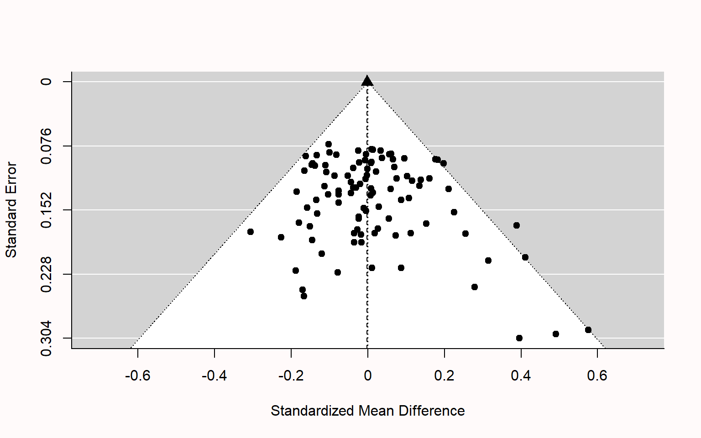
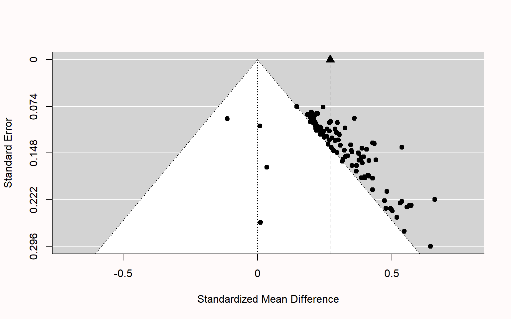
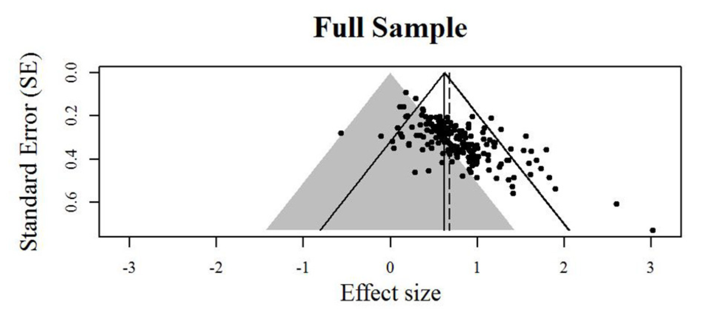

class: title-slide, center, inverse

# `r rmarkdown::metadata$title`

# `r rmarkdown::metadata$subtitle`

## `r rmarkdown::metadata$author`

### `r rmarkdown::metadata$date`


```{r setup, include=FALSE}

# slides & formatting
options(htmltools.dir.version = FALSE)
options(crayon.enabled = TRUE)

xaringanExtra::use_xaringan_extra(c("tile_view", "animate_css", "tachyons"))

# css: [rladies-fonts, default, custom/style.css]
library(xaringanthemer)
style_solarized_light(colors = c(
  red = "#f34213",
  purple = "#3e2f5b",
  orange = "#ff8811",
  green = "#136f63",
  white = "#FFFFFF",
  blue = " #0000FF"
))

# R stuff
library(ggplot2)
nice_theme <- theme_xaringan()+theme(text=element_text(size=9),panel.border=element_blank(),strip.text=element_text(size=rel(0.8)),axis.text=element_text(size=8),panel.grid.minor=element_blank(),axis.line=element_line(size=.4), axis.title=element_text(size=11), legend.title=element_text(size=11))
theme_set(nice_theme)

background_plot <- nice_theme$plot.background$colour
knitr::opts_knit$set(global.par = TRUE) # fix par for multiple plots


library(tidyverse)
library(kableExtra)


# references & citations
library(RefManageR)
# BibOptions(check.entries = FALSE,
#            bib.style = "authoryear",
#            cite.style = "alphabetic",
#            style = "markdown",
#            hyperlink = FALSE,
#            dashed = FALSE)
BibOptions(check.entries = FALSE, bib.style = "authoryear", style = "text")
myBib <- ReadBib("./meta_analyses_references.bib", check = FALSE)

#
library(tidyverse)
library(lme4)
library(sjPlot)
```


---
class: inverse

# Outline

1. Effect sizes

2. Estimating meta-analytic models in R (`metafor` package, `r Citet(myBib, "Viechtbauer2010")`)

3. Meta-analytic regression

4. Multi-level meta analysis

5. Bias detection


---
name: eff_size

# Effect sizes

--

- A summary statistics that capture the _direction_ and _size_ of the "effect" of interest (e.g. the mean difference between two conditions, groups, etc.)
--


- _Unstandardized_ vs. _standardized_
--


- Standardize effect size measures should be used when it is not possible to quantify express results in the same units across different studies; e.g. see `r Citet(myBib, "Baguley2009")`
--


- Example: standardized mean difference $\text{Cohen's }d = \frac{\text{mean difference}}{\text{expected variation of individual observation}}$


- For two independent groups: $\text{Cohen's }d = \frac{{\overline{M}}_{1}{-\overline{M}}_{2}}{\text{SD}_{\text{pooled}}}$


---
class: inverse

### Effect size reliability

For each effect size we need to know how reliable it is. This is typically quantified by the _standard error of the effect size_.
--

Formally we have:

- $\theta_k$ .orange[is the _'true'_ (but unknown) effect size] of study $k$
- $\hat \theta_k = \theta_k + \epsilon_k$ is the .orange[_observed_ effect size]
- $\epsilon_k$ is the .orange['sampling error']
--


The sampling error is the 'uncontrolled' variability (accounting for the fact that even an exact replication of a study would likely give a different result).
--


If we were to repeat the experiment many times (ideally infinitely many) we would obtain the .orange[_sampling distribution_] of the observed effect $\hat \theta_k$.
--


Given a single study, we can never know $\epsilon_k$, however we can estimate it's variability (that is precisely the goal of much of statistics). The .orange[standard error (_SE_)] of the effect size is precisely the standard deviation of the sampling distribution, and therefore it is an estimate of how reliable is a study.
--


---
### Effect size reliability

Example: the standard error of the mean is $$SE = \frac{s}{\sqrt{n}}$$ where $s$ is the sample standard deviation and $n$ the sample size. As $n$ increases, the standard error will decrease proportionally to $\sqrt{n}$. 
--


e.g. study A has twice the sample size of study B
--
$\implies$ the sampling error of study A is expected to be $\frac{1}{\sqrt{2}} \approx 70\%$ that of study B.


---
### Cohen's $d$ reliability


Standard error's for Cohen's $d$:

$$SE(d) = \sqrt{\frac{n_1+n_2}{n_1n_2} + \frac{d^2}{2(n_1+n_2)}}$$


---
### Effect size: range considerations

For the meta-analytic approach taken in `metafor`, we need to ensure that effect size measures are not restricted in their range
--

- if the effect size is a proportion (range restricted between 0 and 1), we can transform this in log-odds: $$\text{log-odds} = \log \left(\frac{p}{1-p}\right),  \qquad  SE_{\text{log-odds}}=\sqrt{\frac{1}{np}+\frac{1}{n(1-p)}}$$
--


- if the effect size is a correlation (range restricted between -1 and 1), we can use Fisher's $z$ transform: $$z = 0.5\log \left(\frac{1+r}{1-r}\right),  \qquad  SE_{z} = \frac{1}{\sqrt{n-3}}$$


---
### Effect size: exercise

The dataset `power_pose` contains 6 pre-registered replications testing whether participants reported higher "feeling-of-power" ratings after adopting expansive 'as opposed to constrictive body postures.

```{r}
power_pose <- read.csv("https://mlisi.xyz/files/workshops/meta_analyses/data/power_pose.csv")
str(power_pose)
```

--
$\\[0.3in]$


.red[
1. Calculate standardized effect size (Cohen's $d$) and its standard error for each study, and add it as an additional column in the dataset.

2. Additional: Compute also the $t$ statistic and the one-sided p-value for each study
]

---

.blue[Formulae:]

.pull-left[

$$\text{Cohen's }d = \frac{{\overline{M}}_{1}{-\overline{M}}_{2}}{\sigma_{\text{pooled}}}$$

$$SE(d) = \sqrt{\frac{n_1+n_2}{n_1n_2} + \frac{d^2}{2(n_1+n_2)}}$$

$$\sigma_{\text{pooled}} = \sqrt{ \frac{(n_1-1)\sigma^2_1 + (n2-1)\sigma^2_2}{n_1 + n_2 -2}}$$


]

--

.pull-right[

$$t = \frac{{\overline{M}}_{1}{-\overline{M}}_{2}}{\sigma_{\text{pooled}}\sqrt{\frac{1}{n1} + \frac{1}{n2}}}$$

]


$\\[1in]$

--

.red[
1. Calculate standardized effect size (Cohen's $d$) and its standard error for each study, and add it as an additional column in the dataset.

2. Additional: Compute also the $t$ statistic and the one-sided p-value for each study
]

---

```{r}
# function for computing pooled SD
pooled_SD <- function(sdA,sdB,nA,nB){
  sqrt((sdA^2*(nA-1) + sdB^2*(nB-1))/(nA+nB-1))
}

# function for Cohen's d
cohen_d_se <- function(n1,n2,d){
  sqrt((n1+n2)/(n1*n2) + (d^2)/(2*(n1+n2)))
}

# apply functions & create new columns in the dataset (using dplyr::mutate)
power_pose <- power_pose %>%
  mutate(pooled_sd =pooled_SD(sd_high_power, sd_low_power, n_high_power, n_low_power), 
         mean_diff =  mean_high_power - mean_low_power,
         cohen_d = mean_diff/pooled_sd,
         SE = cohen_d_se(n_high_power, n_low_power,cohen_d))
```


---

```{r}
# function for computing pooled SD
pooled_SD <- function(sdA,sdB,nA,nB){
  sqrt((sdA^2*(nA-1) + sdB^2*(nB-1))/(nA+nB-1))
}

# function for Cohen's d
cohen_d_se <- function(n1,n2,d){
  sqrt((n1+n2)/(n1*n2) + (d^2)/(2*(n1+n2)))
}

# apply functions & create new columns in the dataset (base R)
power_pose$pooled_sd <- with(power_pose, pooled_SD(sd_high_power, sd_low_power, n_high_power, n_low_power))
power_pose$mean_diff <-  with(power_pose, mean_high_power - mean_low_power)
power_pose$cohen_d <- with(power_pose, mean_diff/pooled_sd)
power_pose$SE <- with(power_pose, cohen_d_se(n_high_power, n_low_power,cohen_d))
```


---

```{r, echo=F}
par(bg = background_plot)
```


```{r, fig.height=5.5,fig.width=10, dev='svg', fig.align='center'}
par(mfrow=c(1,2))
n <- with(power_pose, n_high_power + n_low_power)

plot(n,power_pose$SE, ylab="SE(Cohen's d)",cex=1.5)

plot(power_pose$mean_diff,
     power_pose$cohen_d, 
     xlab = "mean difference (5-point Likert scale)", ylab="Cohen's d",cex=1.5) 

```


---
name: meta_analyses

# Meta-analyses: pooling effect sizes


--


```{r, echol=FALSE, include=FALSE}
par(mfrow=c(1,1))
```


```{r, echo=FALSE, message=FALSE,fig.height=4,fig.width=7, dev='svg', fig.align='center'}
library(metafor)
res <- rma(cohen_d, SE^2, data = power_pose)

forest(res, slab=study, xlim=c(-5,2), xlab="Cohen's d",
       ilab=round(cbind(with(power_pose, n_high_power + n_low_power),
                        mean_low_power, sd_low_power, mean_high_power, sd_high_power),digits=2), 
       ilab.xpos=c(-3.5, -2.5,-2,-1.25,-0.75), cex=.75,
       header="Authors", mlab="")
par(cex=.75, font=2)
text(c(-2.5,-2,-1.25,-0.75), res$k+2, c("mean", "Std.", "mean", "Std."))
text(c(-2.25,-1),     res$k+3, c("Low power", "High power"))
text(-3.5, res$k+2, "N")

text(-5, -1, pos=4, cex=0.9, 
     bquote(paste("RE Model (Q = ",
                  .(formatC(res$QE, digits=2, format="f")), ", df = ", .(res$k - res$p),
                  ", p = ", .(formatC(res$QEp, digits=2, format="f")), "; ", I^2, " = ",
                  .(formatC(res$I2, digits=1, format="f")), "%)")))
```


---
class:inverse
## Random-effects model

We have defined $\theta_k$ as the _true_ effect size of study $k$ and $\hat \theta_k = \theta_k + \epsilon_k$ as the _observed_ effect size.

--

In the random-effects model, we further assume that $\theta_k$ is a random sample from a population of possible studies that measure the same effect but differ in their methods or sample characteristics. These differences introduce .orange[heterogeneity] among the true effects.
--


The random-effects model account for this heterogeneity by treating as an _additional level of randomness_; that is we assume that $$\theta_k = \mu + \zeta_k$$ where $\mu$ is the average of true effects, and $\zeta_k \sim \mathcal{N}(0, \tau^2)$ are random, study-specific fluctuations in the true effect. The variance $\tau^2$ quantifies the amount of heterogeneity among true effects.
--

---
class:inverse
## Random-effects model

Putting it all together we have that $$\hat \theta_k = \mu + \zeta_k + \epsilon_k$$
with $$\zeta_k \sim \mathcal{N}(0, \tau^2) \\ \epsilon_k \sim \mathcal{N}(0, \sigma^2_k)$$

$\\[1in]$

--

Or equivalently, in more compact notation: $$\hat \theta_k \sim \mathcal{N}(\theta_k, \sigma^2_k), \quad \theta_k\sim \mathcal{N}(\mu,  \tau^2)$$


---
## `metafor` package

The function `rma` allows to fit the random-effects model very easily.
--


For the `power_pose` example

```{r}
str(power_pose)
```

we can estimate the model with this command:

```{r}
library(metafor)
res <- rma(cohen_d, SE^2, data = power_pose)
```


---
Model output:

```{r}
summary(res)
```


---
## Measures of heterogeneity

In the random-effects model the $\tau^2$ directly quantify the heterogeneity.
--


There are other measures of of heterogeneity which can be applied also to non random-effects models:

- Cochran’s $Q$ statistic
- $I^2$ statistic
- $H^2$ statistic


---
### Cochran’s $Q$ statistic

Weighted sum of the squared differences between effect size estimates in each study, $\hat \theta_k$, and the meta-analytic effect size estimate, $\hat \mu_k$

$$Q = \sum^K_{k=1}w_k(\hat\theta_k-\hat\mu)^2$$

where $w_k = \frac{1}{\sigma^2_k}$

--

Under the null hypothesis that all effect size differences are caused only by sampling error (no heterogeneity), $Q$ is approximately distributed as $\chi^2$ with $K-1$ degrees of freedom.


---
### $I^2$ statistic

Percentage of variability in the observed effect sizes that is not caused by sampling error

$$ I^2 = \frac{Q-(K-1)}{Q}%$$

where $K$ is the total number of studies.

---
### $H^2$ statistic

$$H^2 = \frac{Q}{K-1}$$

It can be interpreted as the ratio of the observed variation, and the expected variance due to sampling error. 

$H^2>1$ indicates heterogeneity


---
Model output:

```{r}
summary(res)
```


---
Since $\tau^2 \approx 0$, we could also estimate a fixed-effect model (option `method="FE"`)

```{r}
summary(rma(cohen_d, SE^2, data = power_pose, method="FE"))
```


---
The `metafor` package has also a handy function to make .purple[forest plots]:

```{r fig.height=4,fig.width=4, dev='svg', fig.align='center'}
forest(res)
```


---
With only a few addition we can make a publication-quality figure

```{r, fig.height=4,fig.width=7, dev='svg', fig.align='center'}
forest(res, slab=study, xlim=c(-5,2), xlab="Cohen's d",
       ilab=round(cbind(with(power_pose, n_high_power + n_low_power), mean_low_power, sd_low_power, mean_high_power, sd_high_power),digits=2), 
       ilab.xpos=c(-3.5, -2.5,-2,-1.25,-0.75), cex=.75,
       header="Authors", mlab="")
par(cex=.75, font=2)
text(c(-2.5,-2,-1.25,-0.75), res$k+2, c("mean", "Std.", "mean", "Std."))
text(c(-2.25,-1),     res$k+3, c("Low power", "High power"))
text(-3.5, res$k+2, "N")

# this add the results of the heterogeneity test
text(-5, -1, pos=4, cex=0.9, bquote(paste("RE Model (Q = ",.(formatC(res$QE, digits=2, format="f")), ", df = ", .(res$k - res$p),", p = ", .(formatC(res$QEp, digits=2, format="f")), "; ", I^2, " = ", .(formatC(res$I2, digits=1, format="f")), "%)")))
```


---
## Random-effects model exercise

1. `towels` contains results of a set of studies that investigated whether people reuse towels in hotels more often if they are provided with a descriptive norm (a message stating that the majority of guests actually reused their towels), as opposed to a control condition in which they were simply encouraged to reuse the towels (with a message about the protection of the environment)

```{r}
towels <- read.csv("https://mlisi.xyz/files/workshops/meta_analyses/data/towels.csv")
str(towels)
```


---
## Random-effects model exercise

2. `ThirdWave` studies examining the effect of so-called “third wave” psychotherapies on perceived stress in college students. The effect size is the standardized mean difference between a treatment and control group at post-test


```{r}
load(url('https://mlisi.xyz/files/workshops/meta_analyses/data/thirdwave.rda'))
str(ThirdWave)
```

Example taken from the [book](https://bookdown.org/MathiasHarrer/Doing_Meta_Analysis_in_R/) by `r Citet(myBib, "Harrer2021")`.


---
# Meta-analytic regression

Study-level variables ('moderators') can also be included as predictors in meta-analytic models, leading to so-called 'meta-regression' analyses.

Example, with 1 study-level moderator variable $X_k$

$$\hat \theta_k = \beta_0 + \beta X_k + \zeta_k + \epsilon_k$$

where the intercept $\beta_0$ corresponds to the average true effect/outcome $\mu$ when the value of the moderator variable $X_k$ is equal to zero.

---
### Meta-analytic regression example


```{r, echo=F}
font.size <- "7pt"

ThirdWave %>% 
   DT::datatable(
     fillContainer = FALSE,
     options=list(
       pageLength = 12,
       initComplete = htmlwidgets::JS(
          "function(settings, json) {",
          paste0("$(this.api().table().container()).css({'font-size': '", font.size, "'});"),
          "}")
       ) 
     ) %>%
  DT::formatRound(columns=c('TE', 'seTE'), digits=2)

```


---
Does the duration of intervention influence the effect size?

```{r}
# transform duration in a dummy variable
ThirdWave$duration_dummy <- ifelse(ThirdWave$InterventionDuration=="long", 1, 0)

res2 <- rma(yi=TE, vi=seTE^2, data = ThirdWave, mods = duration_dummy)
print(res2)
```


---
.red[Does adding the moderators significantly improve the ability of the model to explain the observed effect sizes?]

```{r}
# refit models using maximum likelihood estimation (ML)
res0 <- rma(yi=TE, vi=seTE^2, data = ThirdWave, method="ML")
res2 <- rma(yi=TE, vi=seTE^2, data = ThirdWave, mods = duration_dummy, method="ML")

# run likelihood ratio test of nested models
anova(res0, res2)
```


---
# "Multi-level" meta analysis $\quad \quad$ (AKA three-level meta analysis)

--

Introduce a hierarchically higher level of randomness in which observed effect sizes are grouped in "clusters" that share some similarities (for example many effect sizes are nested in one study; or many studies are nested in subgroups depending on the nationality of the participants).

--

Formally $$\hat\theta_{ij} = \mu + \zeta_{(2)ij} + \zeta_{(3)j} + \epsilon_{ij}$$


---
### Three-level meta analysis example

```{r}
load(url('https://mlisi.xyz/files/workshops/meta_analyses/data/Chernobyl.rda'))
str(Chernobyl)
```


---
### Three-level meta analysis example

```{r, echo=FALSE}
font.size <- "7pt"

Chernobyl %>% 
   DT::datatable(
     fillContainer = FALSE,
     options=list(
       pageLength = 8,
       initComplete = htmlwidgets::JS(
          "function(settings, json) {",
          paste0("$(this.api().table().container()).css({'font-size': '", font.size, "'});"),
          "}")
       ) 
     ) %>%
  DT::formatRound(columns=c('se.z', 'var.z', 'cor', 'z'), digits=2)
```


--

Studies reported correlation between radioactivity die to the nuclear fallout and mutation rates in humans, caused by the 1986 Chernobyl reactor disaster. 


Most studies reported multiple effect sizes (e.g. because they used several methods to measure mutations or considered several subgroups, such as exposed parents versus their offspring).


---
In R, we can fit a model using the `rma.mv` function and setting the `random` argument to indicate the clustering structure

```{r}
model_cherobyl <- rma.mv(yi = z, V = var.z, 
                     slab = author,
                     data = Chernobyl,
                     random = ~ 1 | author/es.id, # equivalent formulations below:
                     # random = list(~ 1 | author, ~ 1 | interaction(author,es.id)), 
                     # random = list(~ 1 | author, ~ 1 | es.id),
                     method = "REML")

summary(model_cherobyl)
```

---

```{r fig.height=6,fig.width=7, dev='svg', fig.align='center'}
forest(model_cherobyl)
```


---
### "Multi-level" meta analysis exercise:

```{r}
library(metafor)
dat <- dat.konstantopoulos2011
head(dat)
```

Results from 56 studies on the effects of modified school calendars (comparing more frequent but shorter intermittent breaks, to a longer summer break) on student achievement. The effect `yi` is the standardized difference between the groups in each study, and `vi` is the study variance.


(More info about this dataset at this [link](https://wviechtb.github.io/metadat/reference/dat.konstantopoulos2011.html))


---
### "Multi-level" meta analysis exercise

```{r, echo=FALSE}
font.size <- "8pt"

dat %>% 
   DT::datatable(
     fillContainer = FALSE,
     options=list(
       pageLength = 16,
       initComplete = htmlwidgets::JS(
          "function(settings, json) {",
          paste0("$(this.api().table().container()).css({'font-size': '", font.size, "'});"),
          "}")
       ) 
     ) %>%
  DT::formatRound(columns=c('yi', 'vi'), digits=2)
```


---
class:inverse
# Bias detection

Funnel plot

.center[]

Image from `r Citet(myBib, "Lakens")`, [link](https://lakens.github.io/statistical_inferences/bias.html) 


---
class:inverse
# Bias detection

Funnel plot

.center[]

Image from `r Citet(myBib, "Lakens")`, [link](https://lakens.github.io/statistical_inferences/bias.html)


---
class:inverse
# Bias detection

Funnel plot

.center[]

Funnel plot from Carter and McCullough (2014) vizualizing bias in 198 published tests of the ego-depletion effect. 

Image taken from `r Citet(myBib, "Lakens")`, [link](https://lakens.github.io/statistical_inferences/bias.html)


---
#### Funnel plot for `ThirdWave` dataset

```{r, fig.height=4,fig.width=7, dev='svg', fig.align='center'}
res <- rma(yi=TE, vi=seTE^2, data = ThirdWave)
funnel(res, level=c(90, 95, 99), shade=c("white", "gray55", "gray75"), refline=0, legend=TRUE, xlab="Effect size (standardized mean difference)")
```


---
# References


```{r refs, echo=FALSE, results="asis"}
PrintBibliography(myBib)
```


---
### Standardized effect size in LMMs

--

Example: model on 2nd year marks of psychology students

```{r, include=FALSE}
load("./not_shared/exam_data.RData")
m0 <- d1 %>%
  filter(year_of_study=="2") %>%
  lmer(mark ~ gender + (1|student) + (1|module), data=.)
```


```{r, echo=FALSE}
tab_model(m0, digits=4, digits.re=4, show.se=TRUE, show.re.var=TRUE)
```


---
### Standardized effect size in LMMs

Example: model on 2nd year marks of psychology students

```{r, echo=FALSE}
summary(m0)
```


---
class: inverse
### Standardized effect size in LMMs

- The variance of expected mark for females is the standard error of the intercept squared: $$0.0235^2 = \sigma^2_{\text{female}}$$
--


- The variance of expected mark for males is the sum of the standard error of the intercept squared and the standard error of the effect of gender squared, plus twice their covariance: $$\sigma^2_{\text{female}} + 0.0210^2 + \underbrace{2\, r \, \sigma_{\text{female}}\times 0.0210)}_{\text{covariance} \\( r \text{ is the correlation}\\ \text{of fixed effects})}= \sigma^2_{\text{male}}$$
--


- see [variance of the sum of random variables](https://en.wikipedia.org/wiki/Propagation_of_uncertainty#Example_formulae): $$\sigma^2_{A+B}=\sigma^2_{A} + \sigma^2_{B} + \underbrace{2\, r \, \sigma_{A} \,\sigma_{B}}_{\text{cov}(A,B)}$$


---
class: inverse
### Standardized effect size in LMMs

- To calculate the pooled variance, we take into account that there are 530 females and 120 males in the dataset, $$\sigma^2_{\text{pooled}} = \frac{(530-1)\sigma^2_{\text{female}} + (120-1)\sigma^2_{\text{female}}}{530 + 120 -2}$$
--


- Here is the estimate of effect size as estimated by the LMM model
$$\text{Cohen's }d = \frac{\beta_{\text{gender}}}{\sqrt{\sigma^2 + \sigma^2_{\text{pooled}}+ \tau_{\text{student}}+ \tau_{\text{module}} }}$$


